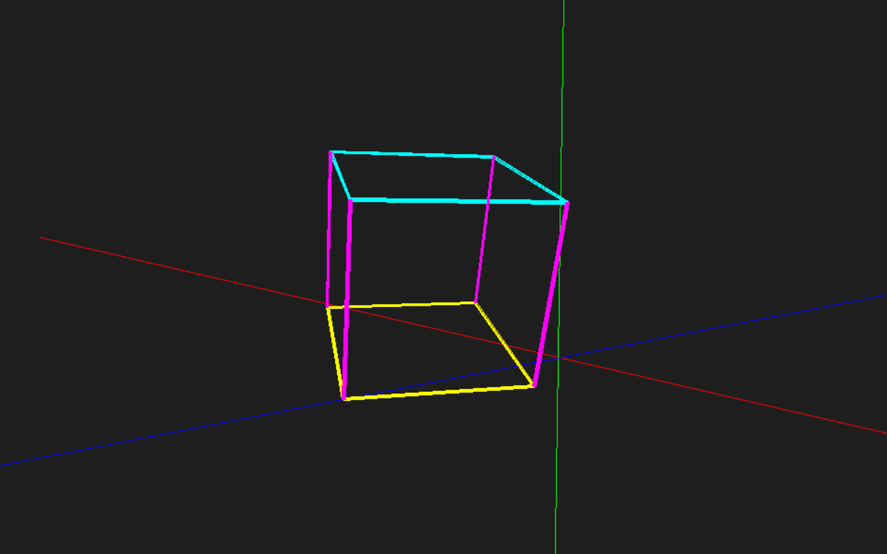
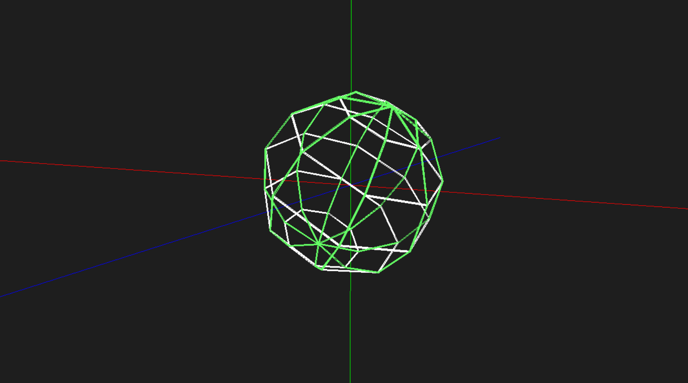

# UEM-CG-Simple3D
Computer Graphics assingment for CS course UEM.

Implement a projective visualization system based on conical perspective.



## Simple3D

Application software for the graphics pipeline, utilizing primitive SDL2 functions with support for Linux and Windows.



## Linux requirements

Ensure you have SDL2 installed:

```bash
sudo apt update
sudo apt install libsdl2-dev
```

## How to Start?

To use Simple3D, if you have Make installed, you can execute:

```bash
make run
```

This will run the file located in the `./bin` folder. 

Alternatively, you can execute it manually via mouse or terminal. Simply start `./bin/Simple3D.exe` on Windows, ensuring the `SDL2.dll` file is present in the same folder.

For Linux, start `./bin/Simple3D`, ensuring you meet the requirement above of having SDL2 installed.

## How to Use?

Simple3D features camera movement and the instantiation of graphic primitives. For movement, we have:

| Keys | Function |  
| :-------: | :------: |
| W | Moves the camera forward  | 
| A | Moves the camera left  |
| S | Moves the camera backward  |
| D | Moves the camera right |
| SPACE | Moves the camera up |
| LCTRL | Moves the camera down |
| LEFT_MOUSE_CLICK | Allows to rotate the camera with mouse |

Additionally, to instantiate your objects on screen, simply edit the `scene.txt`, file, which is expected to be in the **same directory as your executable binary file**. It contains the following main functions:

| Command | Function |  
| :-------: | :------: |
| POINT NAME X Y Z | Creates a Point with NAME at X, Y and Z | 
| SEGMENT P1 P2 | Creates a Segment by point P1 and point P2 |
| TRIANGLE P1 P2 P3 | Creates a Triangle by points P1, P2 and P3 |
| TRANSLATE X Y Z | Translate ALL objects by X, Y, Z |
| ROTATE_X K | Rotate ALL objects by Kº around X axis |
| ROTATE_Y K | Rotate ALL objects by Kº around Y axis |
| AUTO_ROTATE_X K | Rotate ALL objects by K rad around X axis every frame |
| AUTO_ROTATE_Y K | Rotate ALL objects by K rad around Y axis every frame |
| RGB R G B | Paint the next SEGMENTS with color specified |

For usage examples, access `./examples` and te `./bin/scene.txt` file itself.

## How to Compile?

To compile the code yourself, ensure you have **MinGW64** installed along with a compatible version of **Make**. Then, simply execute:

```bash
make clean
make
```

To clean the current directory and compile all code. Finally, execute with:

```bash
make run
```

Feel free to change values in `./include/constants.h` to better customize the application.

## Known Issues

The Linux version has some issues with camera rotation and the execution of some transformations, resulting in significant stuttering/lag.